# hoppy — System Design

Mermaid diagrams for every user-facing flow. Open this file in:
- GitHub (renders inline)
- VS Code with the "Markdown Preview Mermaid Support" extension
- https://mermaid.live (paste a single block)

---

## 0. High-level Architecture

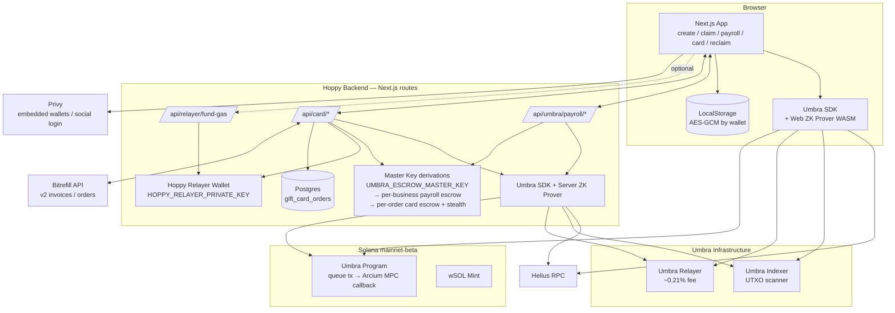

---

## 1. Personal Send

### 1A — Create Link, Basic mode (sender visible on-chain)

Token: SOL / USDC / USDT. No ZK proof, no Umbra. Funds sit in a fresh ephemeral keypair until claimed.

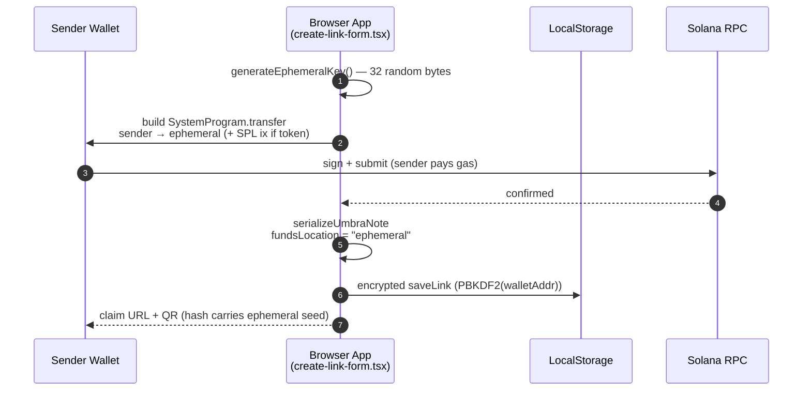

### 1B — Create Link, Private mode (mixer hides sender, SOL only)

Sender publicly funds an ephemeral. Ephemeral then deposits into Umbra's encrypted pool with a Groth16 proof. No Hoppy backend involved.

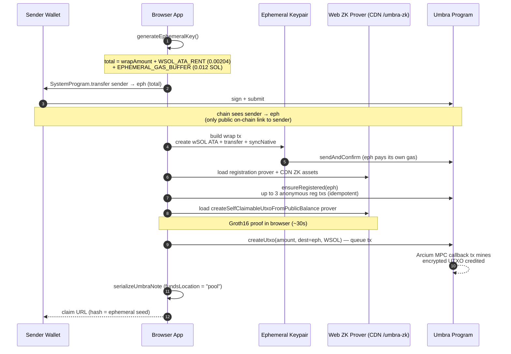

### 1C — Quick Claim (basic note, or private note where recipient forfeits pool)

Drains the ephemeral's leftover native SOL + closes its wSOL ATA. One tx, no Umbra. Recipient never signs.

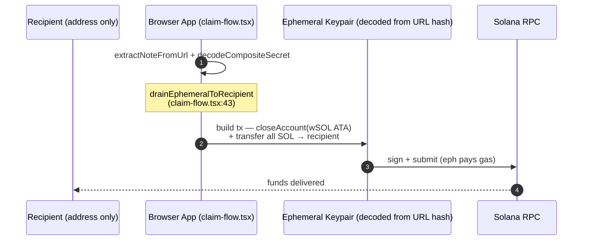

### 1D — Private Claim (note.fundsLocation = "pool", isSOL)

Recipient is invisible to chain observers and to the sender. Self-claimable path (personal send) vs receiver-claimable path (payroll/card links coming through /claim) diverge at the indexer scan.

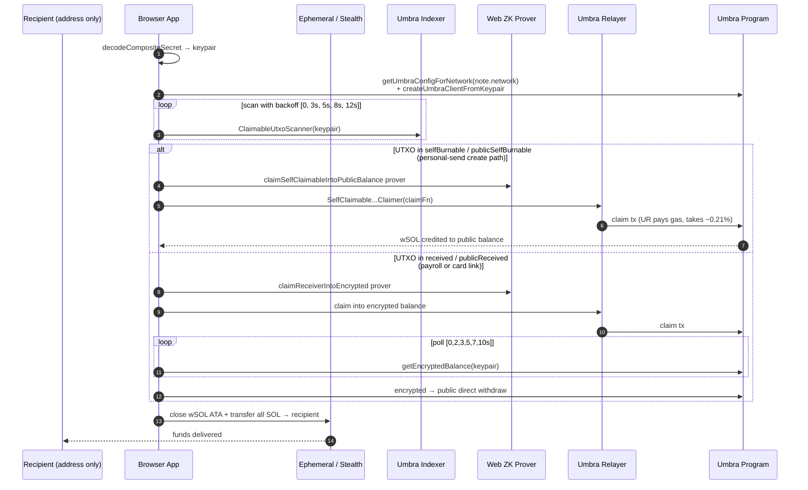

### 1E — Reclaim (orphan ephemeral recovery, /reclaim)

For when a deposit signed but the create-UTXO step failed. Recovery key is saved to localStorage as `hoppy_recovery_v1`.

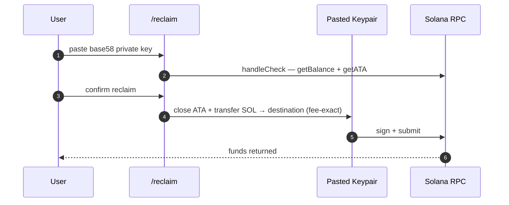

---

## 2. Private Payroll (SOL only, always private)

### 2A — Top-up Deposit

Business signs ONE SystemProgram.transfer into a deterministic escrow keypair. Server wraps to wSOL and deposits to encrypted balance.

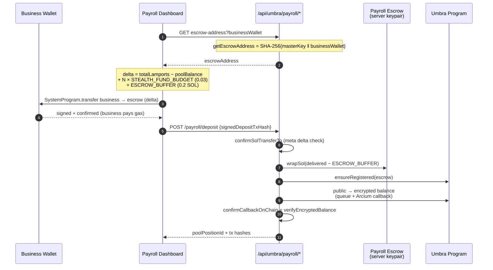

### 2B — Issue Link (per recipient, server-side)

One POST per CSV row. Server-side Groth16 proof (30–120s each).

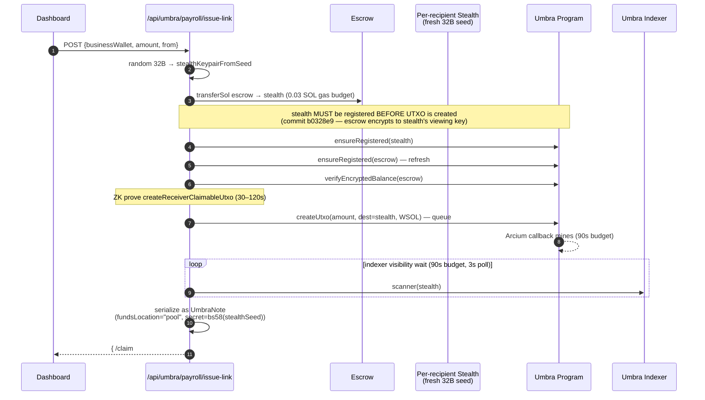

### 2C — Recipient Claim

Shares /claim with personal sends. UTXO lands in `received` bucket → receiver-claimable path. See Diagram 1D (right branch).

### 2D — Bulk Refund (drain unissued escrow)

Recovers everything still inside the escrow keypair. Cannot recover already-issued links — only the URL holder has the stealth seed.

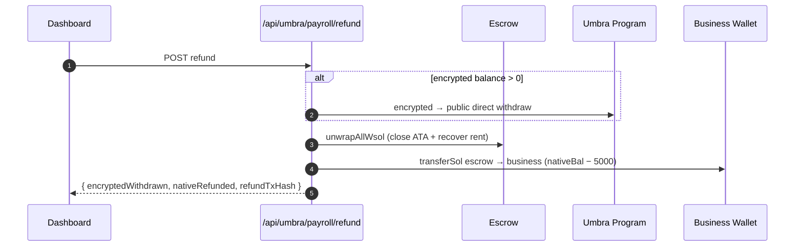

---

## 3. Gift Cards via Bitrefill (SOL only, server-orchestrated)

### 3A — Order Creation

Server-side escrow + stealth keypairs per order. Deposit amount is jittered (+0.002–0.006 SOL) so the on-chain amount doesn't match the Bitrefill invoice.

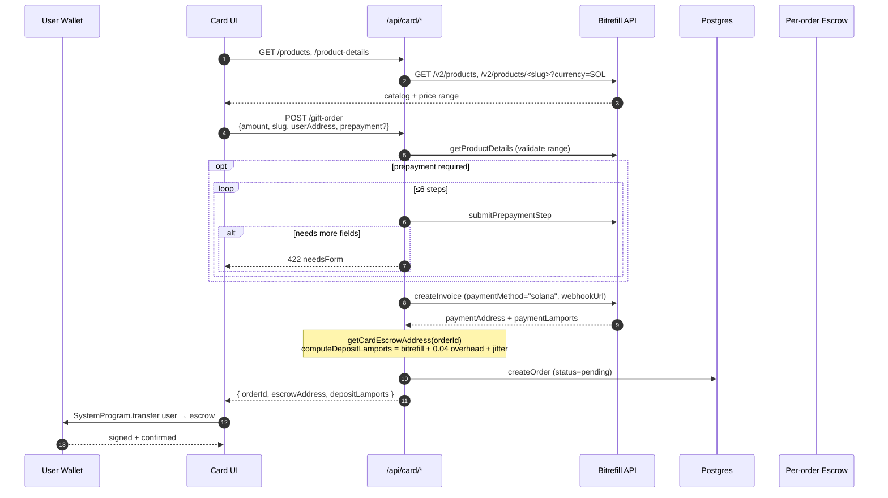

### 3B — Private Execute (the 13-step orchestration)

Fire-and-forget POST returns 202; server runs the pipeline. Result: chain shows two **disjoint** graphs — `(user → escrow → user refund)` and `(relayer → stealth → bitrefill)` — connected only inside the encrypted UTXO.

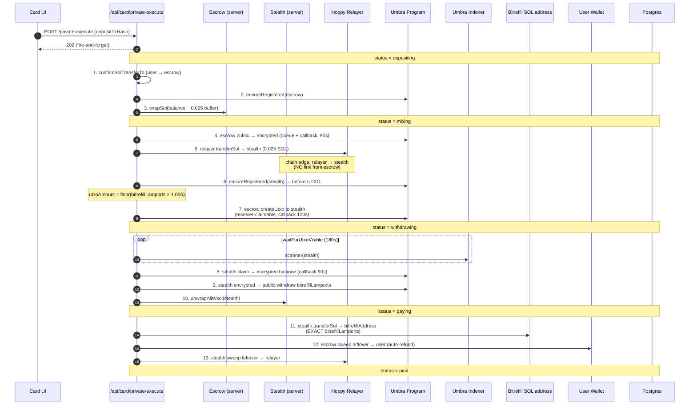

### 3C — Bitrefill Fulfillment (webhook + polling fallback)

Bitrefill notifies via webhook when redemption details are ready. A cron-driven `/poll-bitrefill` covers missed webhooks. AES-256-GCM key lives only in the claim URL fragment — server never persists it.

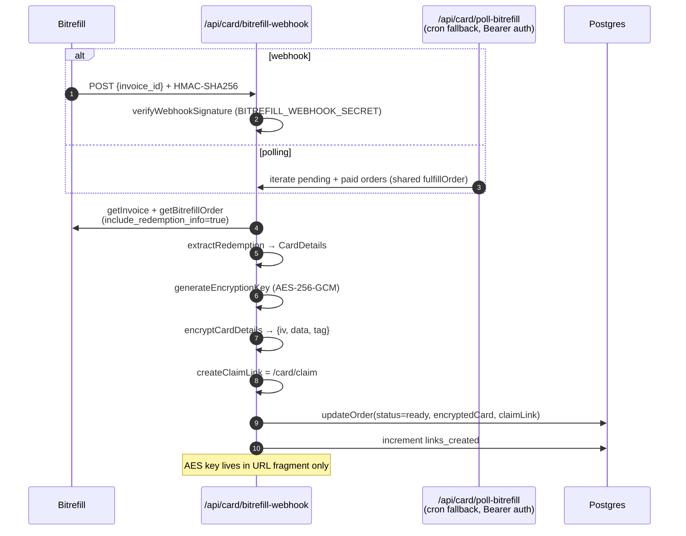

### 3D — Card Claim

Server returns ciphertext; browser decrypts with the URL-fragment key.

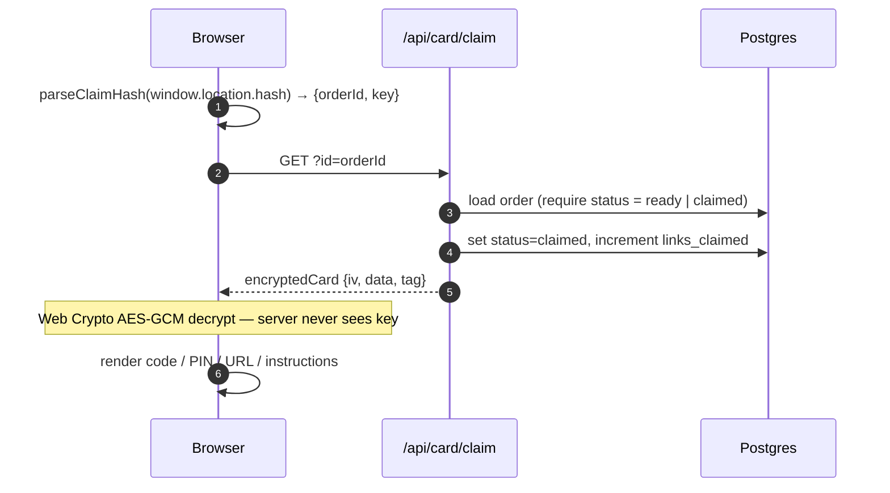

### 3E — Card Refund (pre-fulfillment only)

Wallet must sign a refund challenge. Refund drains BOTH escrow and stealth keypairs (failure could leave funds in either).

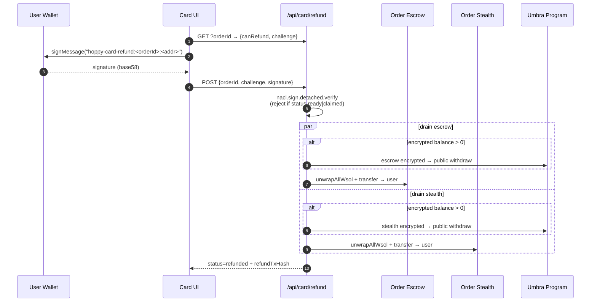

---

## 4. Cross-cutting

### 4A — ZK Prover Map

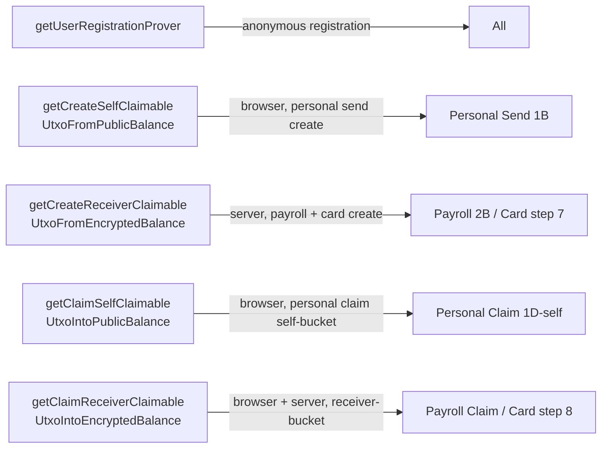

### 4B — Privacy & Trust Comparison

| Flow | Token | Sender visible? | Recipient visible? | ZK proofs | Custody | Key holder |
|---|---|---|---|---|---|---|
| Personal — Basic | SOL/USDC/USDT | yes (sender → eph) | yes (eph → recipient) | none | non-custodial | URL holder |
| Personal — Private + Quick claim | SOL | partial (funded eph) | yes (eph → recipient) | 2× (sender deposit) | non-custodial | URL holder |
| Personal — Private + Private claim | SOL | partial (funded eph) | NO | 4× | non-custodial | URL holder |
| Payroll claim (always private) | SOL | partial (business → escrow once) | NO | per-link Groth16 | server-custodial escrow | URL holder + server (for unissued) |
| Gift card | SOL | partial (user → escrow) | recipient = Bitrefill | per-order Groth16 | server-custodial (escrow + stealth) | server only |

### 4C — On-chain Edges Visible to Observers

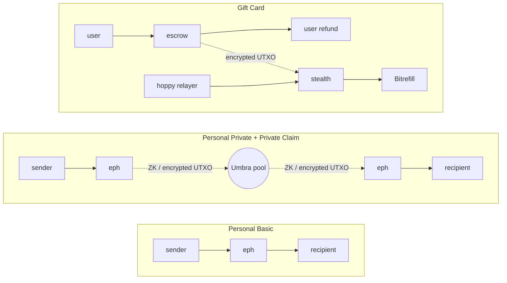

### 4D — Limitations vs Personal Sends

| Capability | Personal | Payroll | Gift Card |
|---|---|---|---|
| Tokens | SOL / USDC / USDT | SOL only | SOL only |
| Basic (non-private) mode | yes | no | no |
| Custody | non-custodial | server holds escrow | server holds escrow + stealth |
| ZK location | browser | server | server |
| Time per issue | ~30s | 30–120s per row | 3–5 min orchestration |
| Refundable by sender | recall via own claim | yes (bulk, unissued) | yes (pre-fulfillment only) |

---

## 5. File-path Index (quick jump)

**Personal send**
- `src/app/create/components/create-link-form.tsx` — `handleDeposit:487`, basic `:652`, private `:543`
- `src/lib/privacy/umbra-adapter.ts` — `generateEphemeralKey:441`, `serializeUmbraNote:546`, `createUmbraClientFromKeypair:702`, `ensureRegistered:800`

**Personal claim**
- `src/app/claim/components/claim-flow.tsx` — `handleClaim:303`, `drainEphemeralToRecipient:43`, receiver branch `:502`, self branch `:650`
- `src/app/reclaim/components/reclaim-page.tsx` — orphan ephemeral recovery

**Payroll**
- `src/app/payroll/components/payroll-dashboard.tsx` — `generate:160`, `handleRefund:59`
- `src/app/api/umbra/payroll/{escrow-address,deposit,issue-link,refund}/route.ts`
- `src/lib/umbra/adapter.ts` — `umbraPayrollDeposit:402`, `umbraPayrollIssueLink:545`, `umbraPayrollRefund:788`
- `src/lib/umbra/keys.ts` — `deriveEscrowSeed:32`, `stealthKeypairFromSeed:50`

**Gift card**
- `src/app/card/components/product-detail-flow.tsx` — `handleCreateOrder:446`, `handleRefund:580`
- `src/app/api/card/{gift-order,private-execute,status,bitrefill-webhook,poll-bitrefill,claim,refund}/route.ts`
- `src/lib/card/umbra-pay.ts` — `umbraCardExecute:360` (13-step), `umbraCardRefund:693`, `computeDepositLamports:138`
- `src/lib/card/bitrefill.ts`, `encryption.ts`, `client-decryption.ts`, `storage.ts`, `db.ts`

**Relayer**
- `src/app/api/relayer/fund-gas/route.ts` (idle today; reserved for SPL flows)
- `src/app/api/relayer/status/route.ts`
